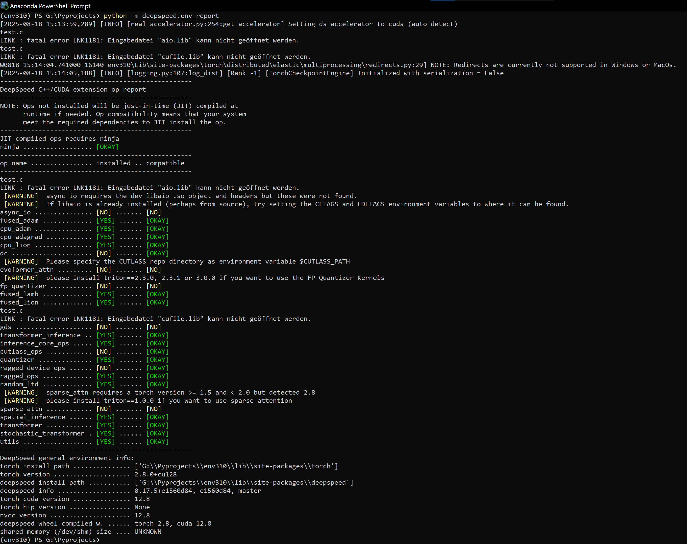

# DeepSpeed Windows Wheels with RTX 50 Support

Prebuilt **DeepSpeed** wheels for **Windows** with **NVIDIA GPU support**.  
Supports **Python 3.9 – 3.12** and **GTX 10** - **RTX 50** series.
Compiled with **pytorch 2.7, 2.8 and cuda 12.8**  
> “The wheels already include CUDA 12.8 support – no separate CUDA toolkit installation  required.”

---

## 📜 Notes

These wheels are provided to simplify DeepSpeed installation on Windows without manual building.  
Official DeepSpeed repository: [https://github.com/deepspeedai/DeepSpeed](https://github.com/deepspeedai/DeepSpeed)

> ⚠ **Windows Notice**  
You may see warnings like:  
`LINK : fatal error LNK1181: cannot open file "aio.lib"`  
`LINK : fatal error LNK1181: cannot open file 'cufile.lib'`  
This is normal on systems without the full CUDA Toolkit.  
DeepSpeed will still work for all regular training and inference tasks.

---

## 🖥️ Requirements

- Windows 10 / 11 (x64)  
- NVIDIA GPU with CUDA-capable drivers  
- Python 3.9 – 3.12  
- pip >= 21.0

---

## 🔧 Preparation

- 1.) **Create Project**
  - Create new folder: `mkdir MyProject`
  - Navigate to new folder: `cd MyProject`
  - Optional install uv: `conda install -y -c conda-forge uv`
- 2.) **Python Environment**
  - Create Environment: `python -m venv env`
  - Activate Environment: `env\Scripts\activate`
- 3.) **Pytorch 2.7.x+cu128 or 2.8.x+cu128**
  - Install pytorch 2.7.0, pytorch 2.7.1 or pytorch 2.8.0 with pip:
  
    **pytorch 2.7.0**

    ```bash
    pip install torch==2.7.0 torchvision==0.22.0 torchaudio==2.7.0 --index-url https://download.pytorch.org/whl/cu128
    ```

    **pytorch 2.7.1**

    ```bash
    pip install torch==2.7.1 torchvision==0.22.1 torchaudio==2.7.1 --index-url https://download.pytorch.org/whl/cu128
    ```

    **pytorch 2.8.0**

    ```bash
    pip install torch==2.8.0 torchvision==0.23.0 torchaudio==2.8.0 --index-url https://download.pytorch.org/whl/cu128
    ```

  - Or install with uv:
  
    **pytorch 2.7.0**

    ```bash
    uv pip install torch==2.7.0 torchvision==0.22.0 torchaudio==2.7.0 --index-url https://download.pytorch.org/whl/cu128
    ```

    **pytorch 2.7.1**

    ```bash
    uv pip install torch==2.7.1 torchvision==0.22.1 torchaudio==2.7.1 --index-url https://download.pytorch.org/whl/cu128
    ```

    **pytorch 2.8.0**

    ```bash
    uv pip install torch==2.8.0 torchvision==0.23.0 torchaudio==2.8.0 --index-url https://download.pytorch.org/whl/cu128
    ```

---

## 📦 Installation

Search the appropriate `.whl` file for your pytorch and python version from the [Releases](https://github.com/6Morpheus6/deepspeed-windows-wheels/releases) page.

### Install it with pip

```bash
pip install https://github.com/6Morpheus6/deepspeed-windows-wheels/releases/download/<tag>deepspeed‑<version>‑<torch version>torch+cu128-cp<python version>‑cp<python version>‑win_amd64.whl
```

**For Example:**

```bash
pip install https://github.com/6Morpheus6/deepspeed-windows-wheels/releases/download/v0.17.5/deepspeed-0.17.5+e1560d84-2.7torch+cu128-cp310-cp310-win_amd64.whl
```

### Or install with uv

```bash
uv pip install https://github.com/6Morpheus6/deepspeed-windows-wheels/releases/download/<tag>deepspeed‑<version>‑<torch version>torch+cu128-cp<python version>‑cp<python version>‑win_amd64.whl
```

**For Example:**

```bash
uv pip install https://github.com/6Morpheus6/deepspeed-windows-wheels/releases/download/v0.17.5/deepspeed-0.17.5+e1560d84-2.7torch+cu128-cp310-cp310-win_amd64.whl
```

### Build from source

#### Prerequistits

- Git
- Python
- Miniconda
- NVIDIA Toolkit
- VS Buildtools 2019

#### Preparation

- Open Anaconda Powershell in your Windows Start menu.
- Create a new project folder `mkdir C:\MyProject`
- Navigate to your project folder `cd C:\MyProject`
- Create a python environment `python -m venv env`
- Activate the environment `env\Scripts\activate`
- Install torch, e.g.: `pip install torch==2.7.0 torchvision==0.22.0 torchaudio==2.7.0 --index-url https://download.pytorch.org/whl/cu128`
- Install build dependencies `pip install setuptools wheel ninja packaging py-cpuinfo psutil`
- Optional: Install dependencies to test your wheel later on `pip install tqdm pydantic msgpack hjson einops`
- Clone DeepSpeed `git clone https://github.com/deepspeedai/DeepSpeed`

#### Compile

- Open x64 Native Tools Command Prompt for VS 2019 in your Windows Start menu.
- Navigate to your project folder `cd C:\MyProject`
- Activate the environment `call env\Scripts\activate`
- Make Windows SDK accessible `set DISTUTILS_USE_SDK=1`
- Set CUDA_HOME (modify the path and toolkit version accordingly)  
  `set CUDA_HOME=C:\Program Files\NVIDIA GPU Computing Toolkit\CUDA\v12.8`
- Add CUDA_HOME to PATH `set PATH=%CUDA_HOME%\bin;%PATH%`
- If git is installed globally it is still accessible. If git is installed as library in conda,  
  you need to make it accessible (modify the path accordingly)  
  `set PATH=C:\Users<username>\AppData\Local\miniconda3\Library\bin;%PATH%`
- Specify the architecture(s) you want to build the wheel for. E.g. if you want to build for all architectures:  
  `set TORCH_CUDA_ARCH_LIST=6.1;7.5;8.6;8.9;12.0`  
  or if you only want to build for RTX 40 series (Ada Lovelace):  
  `set TORCH_CUDA_ARCH_LIST=8.9`
  - A full list of GPU's and their arch type (Compute capability) can be found here [https://en.wikipedia.org/wiki/CUDA](https://en.wikipedia.org/wiki/CUDA)
- Set DeepSpeed environmet variables.

```bash
set DS_BUILD_OPS=1
set DS_BUILD_GDS=0
set DS_BUILD_AIO=0
set DS_BUILD_CUTLASS_OPS=0
set DS_BUILD_SPARSE_ATTN=0
set DS_BUILD_SPARSE_UTILS=0
set DS_BUILD_FP_QUANTIZER=0
set DS_BUILD_DEEP_COMPILE=0
set DS_BUILD_EVOFORMER_ATTN=0
set DS_BUILD_RAGGED_DEVICE_OPS=0
```

- Navigate into the DeepSpeed folder `cd DeepSpeed`
- Compile DeepSpeed `python setup.py bdist_wheel`

> The finished wheel can be found in `C:\MyProject\DeepSpeed\dist`

#### Test the wheel

- Install DeepSpeed into your environment (modify the name accordingly to match your wheel if necessary)  
  `pip install .\dist\deepspeed-0.17.5+e1560d84-cp310-cp310-win_amd64.whl`
- Print Report `python -m deepspeed.env_report`
  
#### Successful build



### ⭐ Support

If this project is useful to you, please consider giving it a ⭐ on GitHub!
